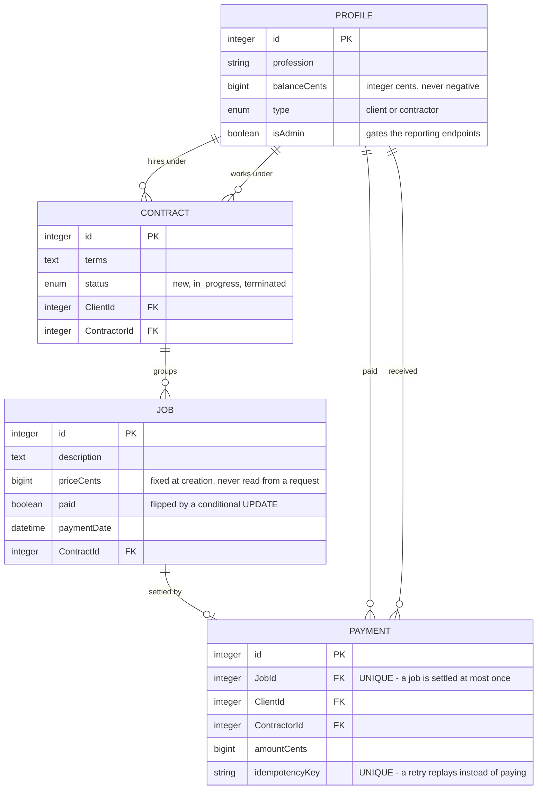
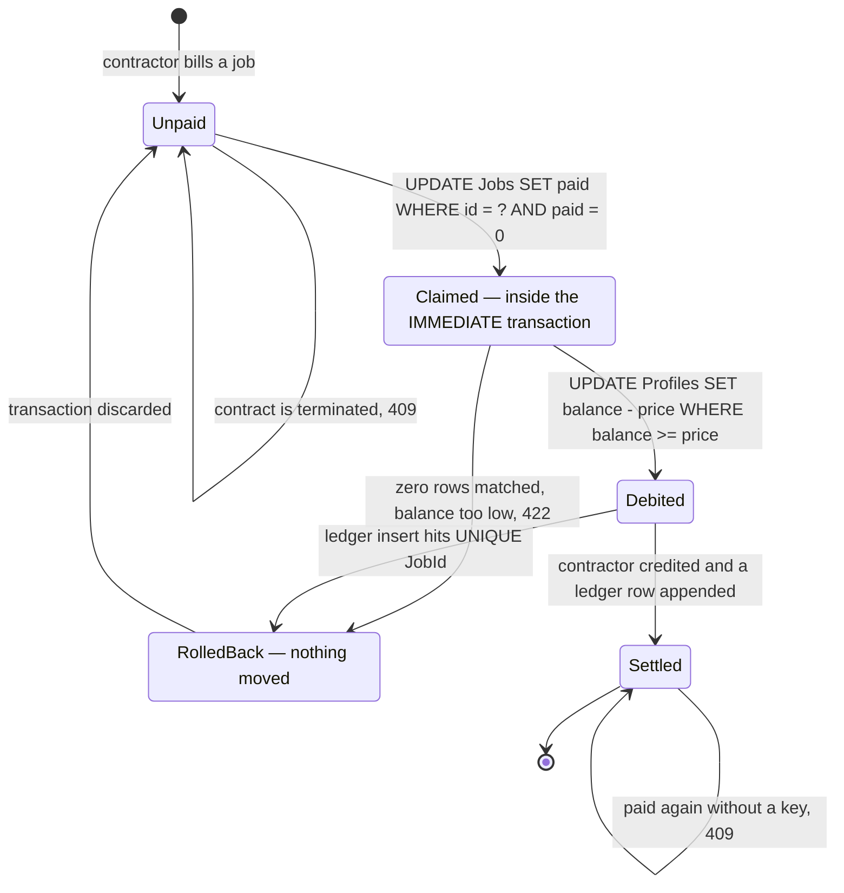

# Contractor Payment Service

Clients hire contractors under a **contract**. Contractors bill **jobs** against that
contract. The client settles a job out of a **balance**, and the money lands in the
contractor's balance. This service is the ledger behind that exchange. Most of it is
ordinary CRUD — the part worth reading is `src/services/payments.service.js` and the
repositories underneath it, because settling a job is the one operation where being
approximately right is the same as being wrong.

```console
$ curl -s -X POST -H 'profile_id: 1' -H 'Idempotency-Key: demo-1' \
       http://localhost:3001/jobs/2/pay
{"replayed":false,"payment":{"id":15,"jobId":2,"clientId":1,"contractorId":6,
 "amount":"201.00","idempotencyKey":"demo-1","createdAt":"2026-09-28T12:29:26.884Z"}}
```

Send that again and you get the same payment back with `"replayed":true` and a 200. Send it
without the key and you get a 409. Either way the money moves once.

## Get it running

Node 18 or newer. There is no external service to install — the database is one SQLite file.

```bash
npm install          # sqlite3 downloads a native binding in an install script
npm run seed         # 9 profiles, 9 contracts, 14 jobs (5 unpaid), 9 payments
npm start            # http://localhost:3001
```

Running the seed again is safe: rows are written by primary key, so a second run restores
the fixture rather than duplicating it. `npm run seed:reset` drops every table first.
Identity is asserted with a `profile_id` header — seeded profiles are 1-8, plus profile 9
(Ada Lovelace) who is the administrator. An OpenAPI reference is served at `/api-docs`.

> If `npm install` succeeds but `require('sqlite3')` throws *Could not locate the bindings
> file*, npm skipped install scripts. Unset `ignore-scripts` in your npm config, or run
> `npm rebuild sqlite3 --ignore-scripts=false`.

## Contracts, jobs and balances



`PAYMENT` is append-only: every balance change has a row there, and that is what
`GET /payments` reads. Its two unique indexes are not conveniences — they are the last line
of defence for "a job is paid at most once", enforced by the database rather than remembered
by the application.

## How a job gets settled



Four properties hold, each with a test that fails without it.

**The amount comes from the job, never from the caller.** `payJob` reads `Job.priceCents`;
a request body of `{"amount": "0.01"}` changes nothing.

**No balance is read into JavaScript and written back.** Both movements are single
statements the database evaluates against the row it is about to write:

```sql
UPDATE Profiles SET balanceCents = balanceCents - :cents
 WHERE id = :clientId AND balanceCents >= :cents
```

The affected-row count answers "did it fit?". A read-modify-write in application code would
let two concurrent settlements observe the same starting balance and both succeed,
overdrawing the client. `payments.integration.test.js` runs two 60.00 settlements against a
100.00 balance and asserts exactly one succeeds and the balances still sum to the start.

**Claiming the job makes the rest exclusive.** The conditional
`UPDATE Jobs SET paid = 1 WHERE id = ? AND paid = 0` happens before any money moves. Three
simultaneous settlements of one job produce one 201, two 409s, one debit and one ledger row.

**A rejection rolls back everything or nothing.** Claim, debit, credit and ledger insert are
one `IMMEDIATE` transaction — no window exists where a job reads as paid but the contractor
was never credited.

SQLite allows one writer per database, so `runInWriteTransaction` in `src/db.js` queues
money-moving transactions in process. That is a throughput measure: without it, concurrent
settlements pile onto the file lock and the losers fail with `SQLITE_BUSY`, turning a valid
payment into a 500. It is explicitly *not* where correctness lives — the conditional UPDATEs
and the unique indexes hold however many processes are writing.

## Why every amount is an integer

Monetary columns store integer cents as `BIGINT`. Decimal strings exist only at the HTTP
boundary and in the seed fixture.

```console
$ node -e "let b=1.00; for(let i=0;i<10;i++) b-=0.10; console.log('float :', b);
           let c=100;  for(let i=0;i<10;i++) c-=10;   console.log('cents :', c);"
float : 1.3877787807814457e-16
cents : 0
```

A client who settles ten 0.10 jobs from a 1.00 balance should be left with nothing; in
binary floating point they are left with a residue that is neither zero nor spendable, and
the drift's direction decides whether money is created or destroyed. `src/money.js` owns
both conversions and refuses sub-cent input rather than rounding it away — depositing
`"1.005"` is a 400, not a silent 1.00. Amounts leave the API as two-decimal strings
(`"201.00"`), so a consumer parsing them into a float cannot reintroduce the problem.

## Who is allowed to do what

| Endpoint | Rule |
|---|---|
| `GET /contracts`, `/contracts/:id` | Only the two profiles named on the contract. Someone else's contract answers **404**, not 403 — a 403 confirms the id exists and turns the endpoint into an oracle over other people's business relationships. |
| `GET /jobs/unpaid` | Either party, and only for contracts in `in_progress`. |
| `POST /jobs/:job_id/pay` | Only the client named on the job's contract. Authorisation is the join condition, so a contractor never reaches the payment path. |
| `POST /balances/deposit/:userId` | `userId` must equal the calling profile. A profile funds only itself. |
| `GET /payments` | The caller's own ledger rows, as payer or payee. |
| `GET /admin/*` | Requires `Profile.isAdmin` or an id in `ADMIN_PROFILE_IDS`. These reports aggregate every account's spend and earnings. |

The `profile_id` header is an assertion, not a proof: anyone who can reach the port can
claim to be anyone. That is the scheme the service is specified around, and it means this
API has to sit behind something that authenticates for real.

## Endpoints

List endpoints return `{ data: [...], page: { limit, offset, total, hasMore } }` and accept
`?limit=` and `?offset=`. `limit` defaults to 25 and is capped by `MAX_PAGE_SIZE`.

| Method | Path | Notes |
|---|---|---|
| `GET` | `/healthz` `/readyz` | Liveness and readiness. No authentication. `/readyz` is 503 when the database cannot be opened. |
| `GET` | `/contracts`, `/contracts/:id` | `?status=new,in_progress` — defaults to both. An unknown status is a 400. |
| `GET` | `/jobs/unpaid` | Nothing outstanding is a 200 with an empty page. |
| `POST` | `/jobs/:job_id/pay` | 201 on settlement, 200 on an idempotent replay. |
| `GET` | `/payments` | Newest first. |
| `POST` | `/balances/deposit/:userId` | Body `{ "amount": "50.00" }`. Capped at 25% of what is currently owed, rounded down. |
| `GET` | `/admin/best-profession` | `?start=&end=` |
| `GET` | `/admin/best-clients` | `?start=&end=&limit=` — limit defaults to 2, capped at 100. |

Errors are always `{ "error": { "code": "...", "message": "..." } }`, unmatched routes
included — branch on `code`.

```console
$ curl -s -X POST -H 'profile_id: 1' http://localhost:3001/jobs/1/pay
{"error":{"code":"contract_terminated","message":"The contract for this job has been terminated"}}
```

## Settings

Every environment-dependent value is read once, in `src/config.js`: `PORT` (3001),
`DB_STORAGE` (`./database.sqlite3`), `DB_LOGGING` (false), `MAX_PAGE_SIZE` (100) and
`ADMIN_PROFILE_IDS` (empty). Copy `.env.example` to `.env` to override any of them.

## Tests

```console
$ npm test
Test Suites: 10 passed, 10 total
Tests:       143 passed, 143 total
```

`npm run test:coverage` reports 90.48% of statements and 88.75% of branches covered. The
integration suites build the same container the server does, over a throwaway SQLite
file, so they exercise real SQL — the conditional UPDATEs, the unique indexes and the
transaction boundaries. That matters here: the double-spend guards live in `WHERE` clauses,
and a mocked ORM cannot show whether they work. `npm run verify` runs ESLint, the Prettier
check and the suite, which is what CI runs on Node 18, 20 and 22.

## Containers

```bash
docker compose run --rm seed     # create the schema in the named volume
docker compose up --build        # http://localhost:3001
```

Multi-stage build, runtime stage runs as the unprivileged `node` user, healthcheck polls
`/readyz`. The SQLite file lives on the `payments-data` volume rather than in the image, so
rebuilding does not take the ledger with it. **The image has not been built or booted in
this checkout** — only `docker compose config` was run against the compose file.

## What this deliberately does not do

- **No real authentication.** Replacing the header scheme means changing one module,
  `src/middleware/getProfile.js`, which is the only thing that populates `req.profile`.
- **No AI feature.** Every operation here is exact arithmetic under hard invariants. Nothing
  in the domain wants a probabilistic answer, and a model bolted onto a ledger is worse than
  nothing.
- **No write endpoints for jobs and contracts.** They arrive via the seed script.
- **A deposit is capped at 25% of what is currently owed**, so a client owing nothing cannot
  deposit at all — 25% of zero is zero. That follows the rule as written rather than
  guessing at an exception.
- **SQLite only.** The write queue in `src/db.js` is shaped by its single-writer model; on a
  server engine it would be unnecessary, though harmless.
